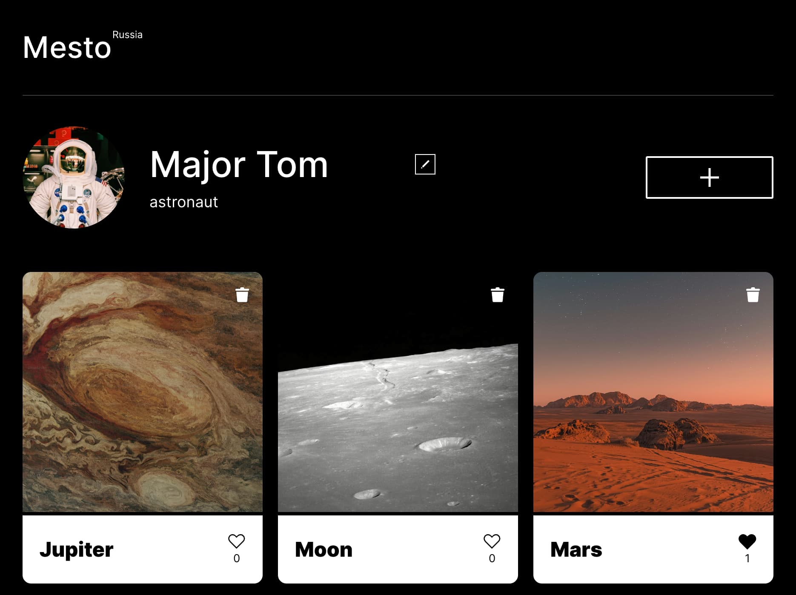
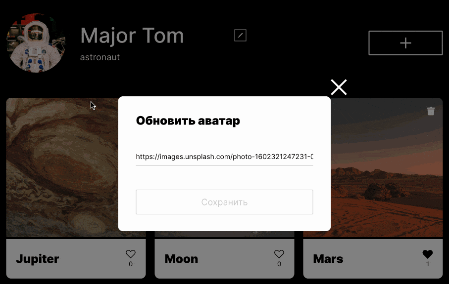
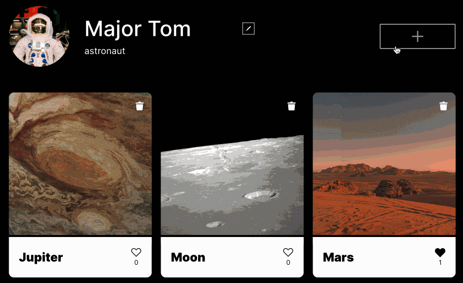
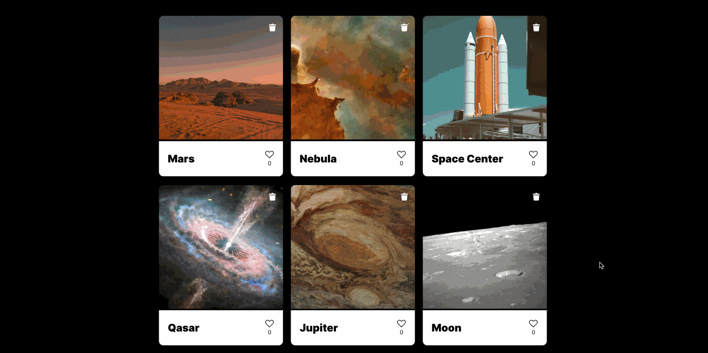
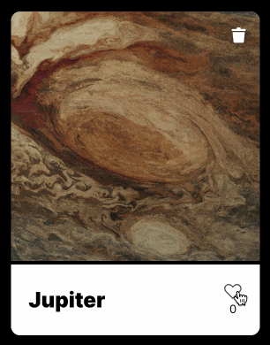
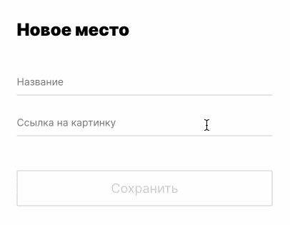

# Mesto — сайт для публикации фотографий

«Mesto» — это учебный проект, созданный в рамках курса «Фронтенд-разработчик» от «Яндекс Практикума». Здесь пользователи могут публиковать фотографии из посещенных мест, а также просматривать и лайкать фотографии других пользователей.

 

 
 

## Технологии

<table align="center">
  <tr>
    <td align="center">
       
      HTML5
    </td>
    <td align="center">
       
      CSS3
    </td>
    <td align="center">
       
      JavaScript
    </td>
   <td align="center">
       
      Webpack
    </td>
  </tr>
</table>

## Особенности

- Возможность изменять фотографию, имя и род деятельности пользователя

 

 
 

 - Добавление своих изображений в общую ленту

 

 
 

  - Просмотр полноразмерных изображений

 

 
 

- Возможность ставить и удалять лайки у фотографий с отправкой данных на сервер

 

 
 

- Валидация форм, включая проверку валидности ссылок на изображения

 

 
 

 ## Запуск проекта

1. Установка зависимостей: npm install

2. Запуск dev-сервера: npm run dev

## Архитектура

В проекте используется модульный интерфейс.

Для каждого элемента приложения созданы специальные переиспользуемые компоненты, включая карточку изображения, ленту изображений и модальные окна. Логика валидации форм также прописана в отдельном компоненте.
  
## Задачи

В рамках этого проекта я выполнил следующие задачи.

- Настроил среду разработки в Webpack.

- Реализовал механизм открытия и закрытия модальных окон с помощью обработчиков событий, создал кастомные события открытия и закрытия модального окна для более гибкого управления.

- Реализовал механизм заполнения и валидации форм при изменении данных пользователя и добавлении карточки.

- Добавил возможность ставить лайки карточкам.

- Настроил интеграцию клиентской части приложения с API.
